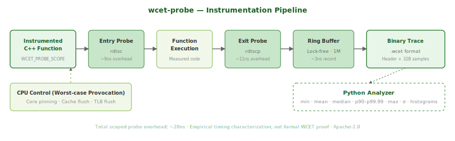

# wcet-probe

**Measurement-based execution-time characterization toolkit for C++ real-time code.**

Instrument, measure, and characterize worst-case-oriented execution timing for C++ functions. Low-overhead probes, lock-free trace collection, and tail-latency analysis — an engineering tool for understanding timing behavior.

## What This Is

A toolkit for characterizing: *"What does the execution-time distribution of this function look like under stress?"*

- **~20ns instrumentation overhead** per probe point (rdtsc + rdtscp + record)
- **Lock-free ring buffer** — 1M+ samples, no allocation in hot path
- **Statistical analysis** — min, mean, median, p90-p99.99, max, σ
- **Binary trace format** — compact, fast, parseable by Python tooling
- **CPU control** — core pinning, cache flushing, TLB pollution for worst-case provocation
- **Calibrated TSC** — automatic frequency detection, tick-to-nanosecond conversion

## What This Is NOT

- Not static WCET analysis (use aiT or Bound-T for that)
- Not a replacement for formal timing verification
- Not certification evidence by itself
- Not safe to use in production flight software instrumentation

This is an engineering tool for understanding timing behavior before you enter the certification process.

## Quick Start

```bash
# Build
cmake -B build -DCMAKE_BUILD_TYPE=Release -DWCET_BUILD_BENCH=ON
cmake --build build -j$(nproc)

# Run built-in examples
./build/wcet-probe --iterations 100000

# Run with cache flushing (worst-case provocation)
./build/wcet-probe --iterations 10000 --flush-cache

# Run with CPU pinning (better measurement quality)
sudo ./build/wcet-probe --iterations 100000 --cpu 2

# Run a specific example with trace output
./build/example_matrix
python3 tools/wcet_analyze.py matrix_multiply.wcet --histogram

# Run tests
cd build && ctest --output-on-failure
```

## Demo Output

```
╔══════════════════════════════════════════════╗
║            wcet-probe v0.1.0                 ║
║  Measurement-based WCET analysis toolkit     ║
╚══════════════════════════════════════════════╝

┌──────────────────────────────────────────────┐
│  WCET Analysis: sort_256                     │
├──────────────────────────────────────────────┤
│  Samples:    50000       TSC: 2.79 GHz      │
├──────────────────────────────────────────────┤
│  Min:        206046     ns                   │
│  Mean:       207990     ns (σ=2958 ns)       │
│  Median:     206735     ns                   │
│  p90:        211231     ns                   │
│  p95:        211869     ns                   │
│  p99:        221155     ns                   │
│  p99.9:      233228     ns                   │
│  p99.99:     263334     ns                   │
│  Max (OWCET):278571     ns                   │
└──────────────────────────────────────────────┘
```

## Instrumentation API

### Scoped Probe (RAII)

```cpp
#include <wcet/probe.hpp>

void my_function() {
    WCET_PROBE_SCOPE(my_function);
    // ... your code here ...
    // Automatically records elapsed time when scope exits
}
```

### Manual Probe

```cpp
void my_function() {
    WCET_PROBE_START(my_function);
    // ... your code here ...
    WCET_PROBE_END(my_function);
}
```

### Measurement Harness

```cpp
#include <wcet/harness.hpp>

wcet::HarnessConfig config;
config.iterations = 100000;
config.warmup = 1000;
config.cpu_pin = 2;
config.flush_cache = true;
config.trace_path = "output.wcet";

auto results = wcet::measure(config, []() {
    my_critical_function();
});

wcet::print_results(results, "my_critical_function");
```

## Instrumentation Overhead

Measured on 2.79 GHz x86_64:

| Operation | Overhead |
|-----------|----------|
| `rdtsc` | ~9 ns |
| `rdtscp` | ~11 ns |
| Probe record | ~3 ns |
| **Full scoped probe** | **~20 ns** |

## Architecture



```
┌──────────────────────────────────────────────┐
│  Your Code                                   │
│  ┌────────────────────┐                      │
│  │ WCET_PROBE_SCOPE() │ ← rdtsc at start    │
│  │   ... work ...     │                      │
│  │ ~destructor        │ ← rdtscp at end      │
│  └────────┬───────────┘                      │
│           ▼                                  │
│  ┌────────────────────┐                      │
│  │ Ring Buffer (1M)   │ ← lock-free push     │
│  │ ProbeSample[32B]   │   no allocation      │
│  └────────┬───────────┘                      │
│           ▼                                  │
│  ┌────────────────────┐                      │
│  │ Binary Trace File  │ ← .wcet format       │
│  │ Header + Samples   │                      │
│  └────────┬───────────┘                      │
└───────────┼──────────────────────────────────┘
            ▼
   ┌────────────────────┐
   │ Python Analysis    │
   │  • Statistics      │
   │  • Histograms      │
   │  • EVT estimation  │ (planned)
   │  • HTML reports    │ (planned)
   └────────────────────┘
```

## Worst-Case Provocation

The toolkit includes utilities to provoke worst-case behavior:

```cpp
#include <wcet/cpu_control.hpp>

wcet::pin_to_cpu(2);          // Eliminate migration jitter
wcet::flush_data_cache();     // Force cold-cache execution
wcet::flush_tlb();            // Force TLB misses
wcet::flush_all();            // All of the above
```

Use `--flush-cache` on the command line to enable cache flushing before each measurement iteration.

## Trace Format

Binary `.wcet` files contain:

| Field | Size | Description |
|-------|------|-------------|
| Header | 48 bytes | Magic, version, TSC frequency, sample count |
| Samples | 32 bytes each | start_tsc, end_tsc, elapsed_tsc, probe_id |

Parse with `tools/wcet_analyze.py` or read directly:

```python
import struct
# See tools/wcet_analyze.py for full parser
```

## Building

**Requirements:** Linux, CMake ≥ 3.25, GCC ≥ 13 or Clang ≥ 17

```bash
# Debug with tests
cmake -B build -DCMAKE_BUILD_TYPE=Debug -DWCET_BUILD_TESTS=ON
cmake --build build -j$(nproc)

# Release with benchmarks
cmake -B build -DCMAKE_BUILD_TYPE=Release -DWCET_BUILD_BENCH=ON
cmake --build build -j$(nproc)
```

## Limitations

1. **Measurement-based only** — does not guarantee true WCET (no static analysis)
2. **Platform-specific** — rdtsc/rdtscp on x86, cntvct_el0 on ARM
3. **No EVT yet** — Extreme Value Theory estimation planned for v0.2
4. **Single-threaded measurement** — harness measures one workload at a time
5. **TSC stability** — assumes invariant TSC (modern x86); may need adjustment on older CPUs

## References

- Measurement-Based Probabilistic Timing Analysis (MBPTA)
- DO-178C § 6.3.4 — Timing and stack usage analysis
- Extreme Value Theory for WCET estimation (Cucu-Grosjean et al.)

## License

Apache-2.0
